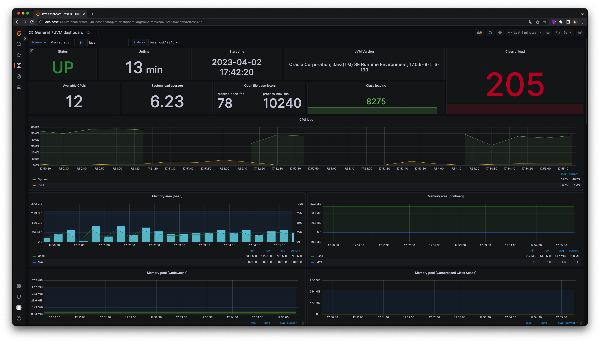
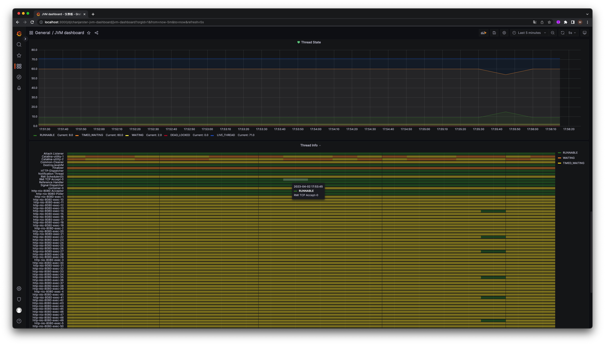

# jmx_minxie
A simple JMX agent for monitoring Java applications.

## 怎么使用?
jmx_agent 提供了assembly打包插件，可通过assembly:assembly 打出一个带依赖的包
jmx_agent-1.0-SNAPSHOT-jar-with-dependencies.jar

这个包是一个agent的包，可以通过-javaagent启动
例如
> java -jar -javaagent:jmx_agent-1.0-SNAPSHOT-jar-with-dependencies.jar=12345 demo.jar

## 示例图

